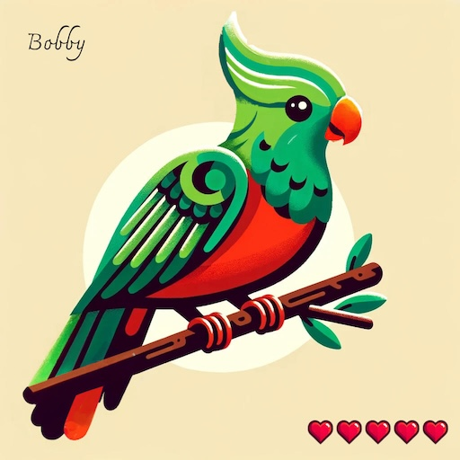

# Quetzals

**CONTRACT:** [**here**](https://better-call.dev/mainnet/KT1R1zAm8M2xEmiH12RiqtsbUFwCgYcE6wCN/operations)

**CONTRACT ID: KT1R1zAm8M2xEmiH12RiqtsbUFwCgYcE6wCN**

**DMETA PROXY URL: https://dmeta.mantodev.com**

**Website (TODO)** [**https://quetzals.xyz**](https://quetzals.xyz)

A quetzal is a colorful bird found in Central America, known for its vibrant green plumage and long tail feathers. They are also the only animal i know with “tz” in its name.

We have a Quetzal NFT collection with unlimited mints, quetzals have **visible traits** such as:

*   Hair
*   Wing
*   Beak
*   Bottom Feathers

combinations of visible traits allow for around **200k unique Quetzals**.

and some **invisible traits:**

*   favorite food
*   hobby

They also have a name and a Health ( internally a integer up to 240, reduces by 1 every hour), Name, Health as well as visible traits are rendered  
by a dynamic metadata wasm module, in order to keep your Quetzal healthy you have to feed it to increase health, if you don't then they will eventually die.

Beyond the standard FA2 **Entrypoints** the Quetzals Contract has these additional entrypoints:

|     |     |     |     |
| --- | --- | --- | --- |
| Name | Arguments | Fee | Comment |
| mint | name: string | 0.1 tez | Mints a new NFT on the sender address |
| feed | token\_id: int | 0.05 tez | Restores Health back to maximum, unless its dead |
| rename | token\_id: int, name: string | 0.05 tez | Renames your Quetzal |

\*You can feed quetzals that you don't own, btw.

Fees will be forwarded to the Ecosystem DAO - KT1VA5SvdE9AU41GY4u7ik5WkTi1pMU4PiTz 

For more info, check out:

**WALLET IMPLEMENTATION GUIDE:** [**here**](./Quetzals/Wallet_Implementation_Guide.md)

**SUBSCRIPTION EXAMPLE CODE:** [**here**](./Quetzals/Example_Code_Live_Updates.md) 

**FILES:** [**here**](./Quetzals/Files.md) 

**LEGACY METADATA:** [**here**](./Quetzals/Legacy_Metadata.md)
