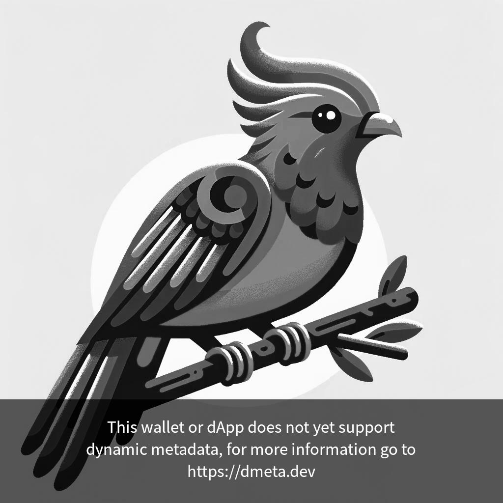

# Legacy Metadata
For some backwards compatibility Quetzals include old-school metadata, the Metadata for evry token is the same and contains:

```application-json
{
  "name": "Quetzal",
  "description": "Quetzals is the first collection on Tezos to utilize the dmeta.dev dynamic metadata standard.",
  "artifactUri": "ipfs://QmbbhYmRpyqv9c19eorgsQzVGzXBou7i9Nn5sozd5AjQge",
  "displayUri": "ipfs://QmbbhYmRpyqv9c19eorgsQzVGzXBou7i9Nn5sozd5AjQge",
  "thumbnailUri": "ipfs://QmbbhYmRpyqv9c19eorgsQzVGzXBou7i9Nn5sozd5AjQge",
  "tags": [
    "quetzal"
  ],
  "publishers": [
    "https://quetzals.xyz"
  ],
  "decimals": 0,
  "isTransferable": true,
  "isBooleanAmount": true,
  "shouldPreferSymbol": false,
  "dmeta": "enabled",
}
```

Applications that do not implement dmeta will see the token name “Quetzal” instead of the custom Name set, and this asset picture:

