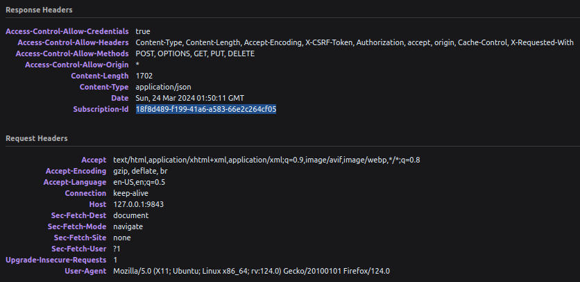

# Wallet Implementation Guide
In absence of a dmeta enabled indexer / token balance API (soon….) the following approach is encouraged:

Fetch metadata as you usually do and look for the field:

```application-json
"dmeta": "enabled"
```

for more Information see the page “Legacy Metadata”

If the above field is present the dmeta Token Metadata can be fetched via:

`http://<proxy>/<network>/<contract>/tokenMetadata/<tokenId>`

This url path `tokenMetadata/<tokenId>` is a dmeta standard and will be the same for all tokens.

The response of this url will be the token metadata for the given token,

In our Case, the metadata will look like the following:

```application-json
{
    "ID": "0",
    "Name": "Bobby",
    "Tags": [
        "dmeta",
        "pfp",
        "generative",
        "animals",
        "bird",
        "quetzal"
    ],
    "Minter": "",
    "Formats": [
        {
            "Uri": "dmeta://KT1R1zAm8M2xEmiH12RiqtsbUFwCgYcE6wCN/tokenImage/0",
            "MimeType": "image/png",
            "Dimensions": {
                "Unit": "px",
                "Value": "1024x1024"
            }
        }
    ],
    "Creators": [],
    "Decimals": "0",
    "Royalties": {
        "Shares": {},
        "Decimals": ""
    },
    "Attributes": [
        {
            "Name": "Beak",
            "Value": "Short Orange"
        },
        {
            "Name": "Feathers",
            "Value": "Big Red"
        },
        {
            "Name": "Hair",
            "Value": "Pointed"
        },
        {
            "Name": "Wing",
            "Value": "Marbled"
        },
        {
            "Name": "Favourite Food",
            "Value": "Nectar"
        },
        {
            "Name": "Hobby",
            "Value": "Sleeping"
        },
        {
            "Name": "Name",
            "Value": "Bobby"
        },
        {
            "Name": "Health",
            "Value": "224"
        },
        {
            "Name": "Status",
            "Value": "Alive"
        }
    ],
    "DisplayUri": "dmeta://KT1R1zAm8M2xEmiH12RiqtsbUFwCgYcE6wCN/tokenImage/0",
    "Publishers": [
        "https://quetzals.xyz"
    ],
    "ArtifactUri": "dmeta://KT1R1zAm8M2xEmiH12RiqtsbUFwCgYcE6wCN/tokenImage/0",
    "Description": "Quetzals are generative birds and a first demo of the dynamic metadata standard developed by Tezos Commons",
    "ThumbnailUri": "dmeta://KT1R1zAm8M2xEmiH12RiqtsbUFwCgYcE6wCN/tokenThumbnail/0",
    "IsTransferable": true,
    "IsBooleanAmount": true,
    "ShouldPreferSymbol": false
}
```

You should expect this metadata to change, its attributes or the image URLs to change.

Making dmeta requests

dmeta - Links have a format similar to `dmeta://KT1R1zAm8M2xEmiH12RiqtsbUFwCgYcE6wCN/tokenImage/0`  
they start with dmeta:// , then the contract, then the path, the path is handed to the dmeta wasm module and the module is responsible for producing the response or file at that location, the following path is standardized for token metadata:

`dmeta://<contract>/tokenMetadata/<tokeId>`

beyond that, a dmeta wasm is free to allow any paths it wants, in the metadata above for example we link to dmeta URLs for images.

Generally, you can request the result via two ways via the proxy:

1.) Standard Requests

Substitute dmeta:// for: <proxyUrl>/<network>

for example

`dmeta://**KT1R1zAm8M2xEmiH12RiqtsbUFwCgYcE6wCN/tokenImage/0**`

becomes

`https://dmeta.mantodev.com/mainnet/**KT1R1zAm8M2xEmiH12RiqtsbUFwCgYcE6wCN/tokenImage/0**`

2.) exec Reqeusts

provide more details, similar url but with exec as a path segment,

for example:

`https://dmeta.mantodev.com/exec/mainnet/KT1R1zAm8M2xEmiH12RiqtsbUFwCgYcE6wCN/tokenMetadata/0`

will always return a JSON response:

```text-plain
{
"Headers": {
	"content-type": "application/json"
},
"Body": "7b224...[truncated]",
"Dependencies": [
	"dmeta://KT1R1zAm8M2xEmiH12RiqtsbUFwCgYcE6wCN/token_names/0",
	"dmeta://KT1R1zAm8M2xEmiH12RiqtsbUFwCgYcE6wCN/token_health/0/_data",
	"dmeta://bigmaps/616322/0",
	"dmeta://bigmaps/616323/0/_data"
],
"SubscriptionId": "1308fbe7-e8ef-4ccf-8eee-ca6845b7949e",
"BlockLevel": 5310352,
"Cached": false
}
```

Where:

Headers - are the HTTP Response Headers the Proxy would send on a standard call  
Body - is the body of the request ( document or image) in standard hex encoding  
Dependencies - are the on chain information that this result depends on  
SubscriptionId - is the id used to get live updates

Subscriptions

All Results generated and served via the dmeta proxy have a subscription id, when making a standard request this can be found in a HTTP Header:



If making a exec Request the Subscription ID can be found in the JSON, see above.

Clients can subscribe to Live updates by opening a websocket connection to <proxyUrl>/subscribe.

One Connection can have multiple subscriptions, to add a new subscription to the connection send for example:

`{"action":"subscribe","subscriptions":["e9fcad77-7b59-41d4-8933-ad15076e6480"],"id":"123"}`

Server will respond with:

`{"id":"123","msg":"Okay"}`

where id is the ID provided in the user request, RequestIds have no meaning to the server, they are used by clients to know which messages have been acknowledged.

When the result changes the Proxy will inform the client via a message containing the subscription id:

`{"subscription_update":"e9fcad77-7b59-41d4-8933-ad15076e6480"}`